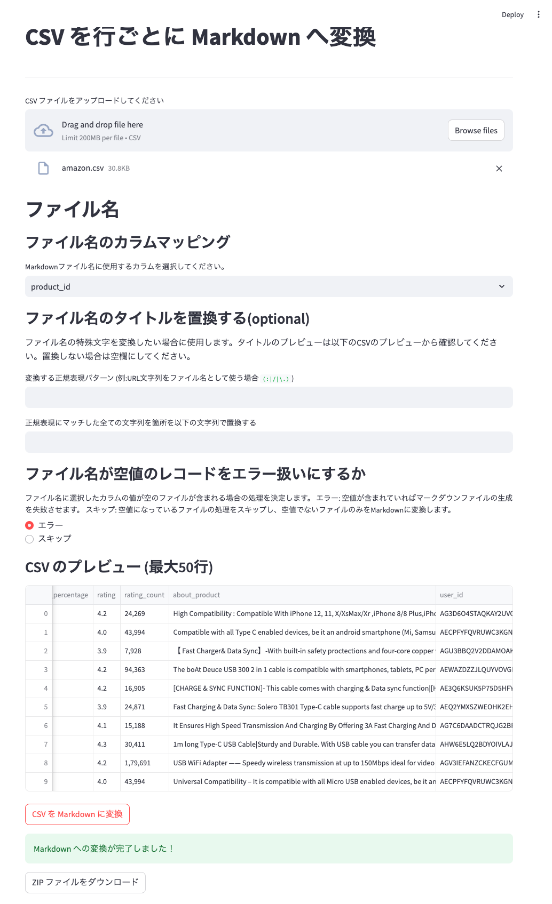

# csv2md
csvを行単位のマークダウンに変換するブラウザベースのアプリです。

## 機能

| 機能 | 概要 |
| --- | --- |
| csv変換 | csvファイルを入力にとり、行単位で1Markdownファイルに変換します。 | 
| ファイル名設定 | Markdownファイル名にcsvファイルの各行の値を採用することができます。 |
| ファイル名変換 | 値に対して正規表現で文字列置換を適用した文字列をタイトルとして採用する機能をサポートします。 |

### 変換例

- 入力: [demo/demo_data_src.csv](./demo/demo_data_src.csv) の10行のcsv
- 出力: [demo/demo_data_proccessed](./demo/demo_data_proccessed) の10ファイルの Markdown ファイル

### 画面



## 使い方

### 使う際に用意するもの
- csvファイル
- デモデータは[kaggle](https://www.kaggle.com/datasets/karkavelrajaj/amazon-sales-dataset?resource=download)などからダウンロードできます。

### 変換を行う
サーバーを立ち上げます。

```bash
streamlit run app.py
```

http://localhost:8501/ にアクセスしてください。

csvファイルをアップロードし、以下を設定します。
- タイトルとして使うカラム
- タイトルの文字列に対して正規表現で文字列置換を行う場合は置換にも散る正規表現と置き換え先の文字列

設定ができたら画面下部のボタンから変換を行います。
変換が完了したらMarkdown形式のファイルをzipファイルとしてダウンロードすることができます。

# 今後サポートしたい機能
- csvの値をMarkdownに変換する際、テンプレートエンジンを変換に用いることができるような仕組み
- タイトル以外の値も柔軟に変更できるような仕組み
